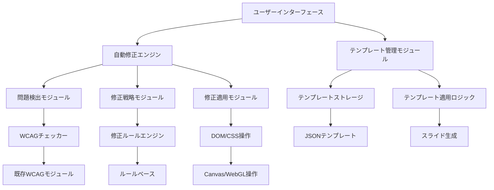

# アクセシブルテンプレートと自動修正機能の設計

## 概要

ViewSureアプリケーションに「アクセシブルテンプレートと自動修正機能」を実装するための設計ドキュメント。この機能は、ユーザーがWCAG 2.2ガイドラインに準拠したアクセシブルなプレゼンテーション資料を簡単に作成できるように支援することを目的とする。

## 機能要件

### 1. アクセシブルテンプレート機能
- 学術発表、ビジネス、教育など目的別のアクセシブルテンプレートを提供
- テンプレートはWCAG 2.2の要件を満たすように設計
- ユーザーがテンプレートをベースに資料を作成できる機能

### 2. 自動修正機能
- AIによる自動アクセシビリティ修正（色のコントラスト、フォントサイズ、読み上げ順序など）
- 修正前後の比較と、修正理由の説明
- ユーザーが修正を承認または拒否できるインタラクティブな機能

## 技術的アプローチ

### 1. アーキテクチャ設計



### 2. データ構造設計

#### テンプレートデータ構造
```typescript
interface AccessibleTemplate {
  id: string;
  name: string;
  description: string;
  category: 'academic' | 'business' | 'education' | 'general';
  preview: string; // プレビュー画像URL
  slides: TemplateSlide[];
  wcagCompliance: {
    level: 'AA' | 'AAA';
    guidelines: string[]; // 準拠しているWCAGガイドライン
  };
}

interface TemplateSlide {
  id: string;
  name: string;
  elements: TemplateElement[];
  layout: SlideLayout;
}

interface TemplateElement {
  id: string;
  type: 'title' | 'heading' | 'text' | 'image' | 'list' | 'table';
  position: { x: number; y: number; width: number; height: number };
  style: ElementStyle;
  content: string;
  accessibility: {
    role: string;
    ariaLabel?: string;
    readingOrder: number;
  };
}
```

#### 修正戦略データ構造
```typescript
interface CorrectionStrategy {
  id: string;
  issueType: WcagIssueType;
  priority: 'high' | 'medium' | 'low';
  autoApplicable: boolean;
  correction: CorrectionAction;
  explanation: string;
  wcagReference: string;
}

interface CorrectionAction {
  type: 'color' | 'fontSize' | 'position' | 'structure' | 'content';
  target: string; // ターゲット要素のセレクタ
  parameters: Record<string, any>;
}
```

### 3. 実装戦略

#### フェーズ1: テンプレート機能の実装
1. **テンプレートデータ構造の定義**
   - アクセシブルなテンプレートのJSONスキーマ設計
   - 既存のスライド構造との互換性確保

2. **テンプレート管理モジュールの実装**
   - テンプレートの読み込みと適用
   - テンプレートからの新規プロジェクト作成

3. **テンプレートUIコンポーネントの実装**
   - テンプレート選択インターフェース
   - テンプレートプレビュー機能

#### フェーズ2: 自動修正機能の実装
1. **問題検出モジュールの拡張**
   - 既存のWCAGチェッカーとの連携強化
   - 修正可能な問題の特定

2. **修正戦略エンジンの実装**
   - ルールベースの修正戦略定義
   - 優先順位付けアルゴリズム

3. **修正適用モジュールの実装**
   - Canvas/WebGLコンテキストでの修正適用
   - 修正の元に戻す機能

#### フェーズ3: UI/UXの統合
1. **自動修正UIの実装**
   - 修正提案の表示
   - 修正前後の比較機能
   - 一括適用と個別適用の選択

2. **ユーザーガイド機能の実装**
   - 修正理由の説明
   - WCAGガイドラインへの参照

### 4. 技術的考慮事項

#### パフォーマンス
- 大規模なプレゼンテーションでの自動修正のパフォーマンス確保
- Web Workersを使用したバックグラウンド処理
- 修正結果のキャッシュ機構

#### 互換性
- 既存のプロジェクター機能との互換性確保
- 異なるファイル形式（PDF、PPTX、画像）への対応
- 既存のWCAGチェック機能との連携

#### 拡張性
- 新しいテンプレートの追加が容易な設計
- 修正戦略の動的な更新機能
- 将来的なAI機能との連携を考慮した設計

### 5. 実装における課題と解決策

#### 課題1: Canvas/WebGLコンテキストでのDOM操作
- **課題**: CanvasやWebGLでレンダリングされたコンテンツへの直接のDOM操作が困難
- **解決策**: 
  - 仮想DOMのような抽象化レイヤーを実装
  - 修正操作を中間表現に変換し、レンダリングエンジンに適用
  - 既存の`useProjectionRenderer`フックを拡張

#### 課題2: 異なるファイル形式の一貫した処理
- **課題**: PDF、PPTX、画像で異なるデータ構造と処理方法
- **解決策**:
  - 共通の中間表現（IR）を定義
  - ファイル形式ごとのアダプターを実装
  - 修正操作を中間表現に対して実行し、各形式に変換

#### 課題3: 自動修正の品質保証
- **課題**: 自動修正が意図しないデザイン変更を引き起こす可能性
- **解決策**:
  - 修正前後の比較機能の実装
  - ユーザーが修正を承認/拒否できるワークフロー
  - 修正の重要度に基づく段階的適用

### 6. 既存コードとの統合

#### 既存モジュールの活用
- `src/utils/wcag/analyzer.ts`: WCAG問題検出に活用
- `src/hooks/useProjectionRenderer.ts`: レンダリング機能に統合
- `src/types/projects.ts`: プロジェクトデータ構造を拡張
- `src/components/ProjectionViewport.tsx`: 修正結果の表示に活用

#### 新規モジュールの追加
- `src/utils/templates/`: テンプレート管理モジュール
- `src/utils/autoCorrection/`: 自動修正エンジン
- `src/components/TemplateSelector.tsx`: テンプレート選択UI
- `src/components/AutoCorrectionPanel.tsx`: 自動修正パネル

### 7. テスト戦略

#### 単体テスト
- テンプレート読み込みと適用のテスト
- 修正戦略の適用テスト
- WCAG問題検出のテスト

#### 統合テスト
- テンプレートからプロジェクト作成のエンドツーエンドテスト
- 自動修正ワークフローのテスト
- 異なるファイル形式での修正適用テスト

#### ユーザビリティテスト
- アクセシビリティ専門家による評価
- 実際のユーザーによる使用感テスト
- 修正品質の評価

## まとめ

アクセシブルテンプレートと自動修正機能は、ViewSureをより包括的なアクセシビリティ支援ツールへと進化させるための重要な機能です。この設計に基づいて実装を進めることで、ユーザーは専門知識がなくてもWCAG 2.2に準拠したアクセシブルなプレゼンテーション資料を簡単に作成できるようになります。

実装にあたっては、既存のアーキテクチャを尊重しつつ、新しい機能をシームレスに統合することが重要です。また、ユーザーが修正プロセスを理解し、コントロールできるようにすることで、ツールへの信頼性と満足度を高めることができます。